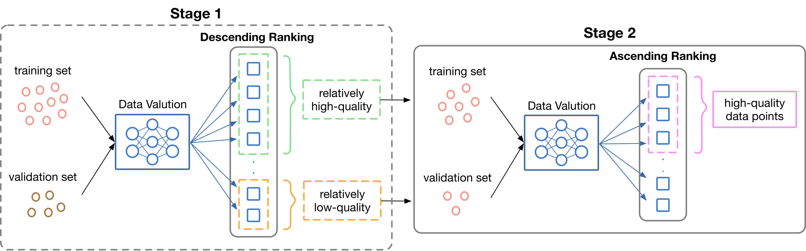

# JST (Just Select Twice) Data Valuation Framework

This repository is the official implementation of "[Just Select Twice: Leveraging Low Quality Data to Improve Data Selection (release soon)]()." This paper introduces a novel approach, **JST (Just Select Twice)**, which aims to improve the sensitivity of data valuation methods to high-quality data, thereby facilitating more effective data selection.

## Our Approach: JST (Just Select Twice)



We propose JST, a two-stage data subset selection framework. The key steps are:

1. **Initial Data Valuation**: Perform data valuation using existing methods to identify low-quality data points.
2. **Second-Round Selection**: Use the identified low-quality data points as a validation set for a second round of data valuation. This allows high-quality data to stand out as outliers in the new context.

This two-stage approach enhances the sensitivity of data valuation methods to high-quality data, improving the effectiveness of data selection.

## Requirements

Create a Docker container and install required packages. 
```sh
docker run --gpus all -it nvcr.io/nvidia/pytorch:23.10-py3
./starting.sh
```
## Experimental Evaluation

We conducted experiments to validate the effectiveness of our JST framework, instantiated with the optimal transport based data valuation method. We provide code examples in enhancing data valuation methods for high-quality data selection.

**High-Quality Data Selection**: 
  - **Datasets**: [MNIST](JST_mnist.ipynb), [Fashion-MNIST](JST_fashionmnist.ipynb), [CIFAR-10](JST_cifar10.ipynb), and [CIFAR-100](JST_cifar100.ipynb).
  - **Setup**: We injected white noise into 25% of the training set and used the clean test set as the validation set. Data points were ranked based on their value scores, and selection precision (percentage of uncorrupted points within the selected subset) was computed.
  - **Results**: Our experimental results showed a notable enhancement in selection precision across all four datasets. (In the final comparison plotting, it may not be correctly loaded in github preview version because we use the interactive line plot. After downloading the notebook, it can correctly display.)

## Acknowledgement

This repo is directly implemented based on the repos [LAVA](https://github.com/reds-lab/LAVA) and [otdd](https://github.com/microsoft/otdd). We are immensely grateful to the authors of that project.

## Citing JST
If you found the code/scripts here are useful to your work, please cite JST by
```sh
@inproceedings{zhang2024jst,
  title={Just Select Twice: Leveraging Low Quality Data to Improve Data Selection},
  author={Zhang, Yifei and Jiao, Yusen and Chen, Jiayi and Li, Zhaoyang and Yao, Huaxiu and Zhang, Jieyu and Sala, Frederic},
  year={2024}
}
```
